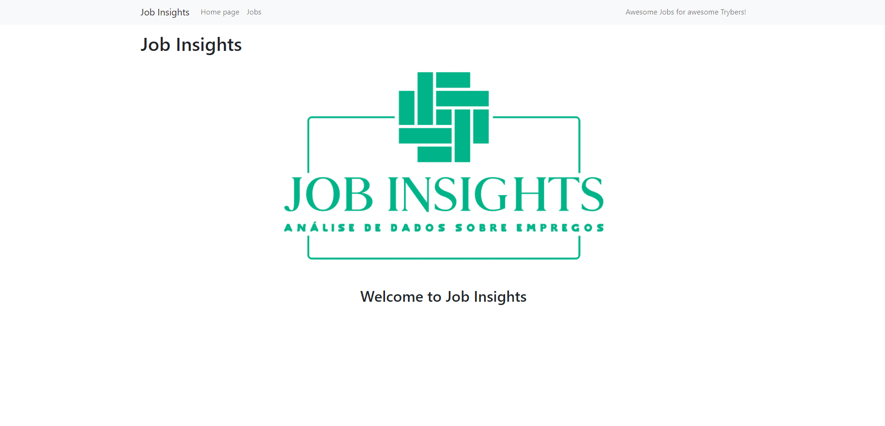

# Job Insights
Functions were developed that carry out the analysis of job data, the main ones being: read the file that contains the jobs, the types of jobs and industries, the highest and lowest salary, jobs and industries filtered by type and jobs filtered by salary. In addition to tests for these functions.

Note: The Flask framework and all Jinja2 code was developed by [Trybe](https://github.com/tryber). Regarding Flask, I developed the `/job/<index>` route and the `job` function.

## Features

- Header bar
- Job filters
- Table of jobs
- Job details




## Stack

- [Python](https://www.python.org/) - Linguagem de programação focada em desenvolvimento rápido e integração de sistemas eficazmente
- [Pytest](https://docs.pytest.org/en/7.2.x/) - Framework makes it easy to write small, readable tests
- [Flask](https://flask.palletsprojects.com/en/2.2.x/) - Micro framework for building web applications
- [Jinja2](https://jinja.palletsprojects.com/en/3.1.x/) - Extensible templating engine

## Project structure

```
$PROJECT_ROOT
├── README.md
├── Dockerfile
├── docker-compose.yml
├── dev-requirements.txt
├── requirements.txt
├── data
│   └── jobs.csv
├── src
│   ├── flask_app
│   │   ├── templates
│   │   │   ├── includes
│   │   │   │   └── nav.jinja2
│   │   │   ├── base.jinja2
│   │   │   ├── index.jinja2
│   │   │   ├── job.jinja2
│   │   │   └── list_jobs.jinja2
│   │   ├── app.py
│   │   ├── more_insights.py
│   │   └── routes_and_views.py
│   ├── insights
│   │   ├── industries.py
│   │   ├── jobs.py
│   │   └── salaries.py
│   └── pre_built
│       ├── brazilian_jobs.py
│       ├── counter.py
│       └── sorting.py
└── tests
    ├── __init__.py
    ├── conftest.py
    ├── brazilian
    │   ├── __init__.py
    │   └── test_brazilian_jobs.py
    ├── counter
    │   ├── __init__.py
    │   └── test_counter.py
    └── sorting
        ├── __init__.py
        └── test_sorting.py
```

## How to run

Prerequisites: [Python3](https://www.python.org/downloads/)

Creating and activating the Python virtual environment

```bash
python3 -m venv .venv && source .venv/bin/activate
# windows
python3 -m venv .venv && .\.venv\Scripts\activate
```

Installing the dependencies

```bash
python3 -m pip install -r dev-requirements.txt
```

Uploading the application

```bash
python3 -m flask run
```

To disable the virtual environment, use the `deactivate` command.